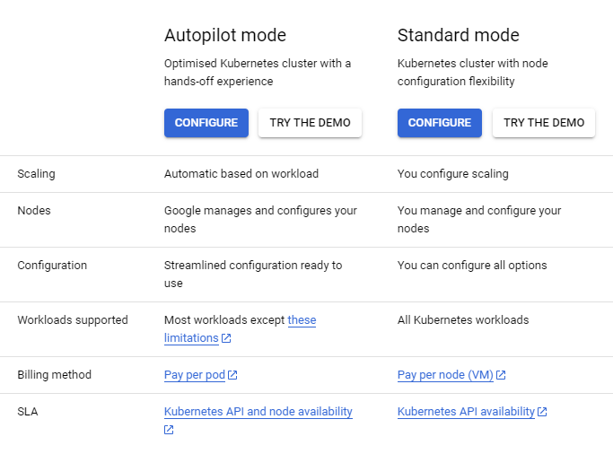

# Google Kubernetes Engine (GKE) Setup

## What is GKE?
Google Kubernetes Engine(GKE) is a Google's implementation of the Kubernetes open source container orchestration platform. GKE has two types of clusters. GKE is ideal if you need a platform that lets you configure the infrastructure that runs your containerized apps, such as networking, scaling, hardware, and security. 

### Modes of operation
GKE clusters can be created using the following modes of operation. This determines the level of control you want with your cluster.

* Autopilot Cluster: All cluster infrastructure management and operations are taken care of by Google Cloud. Customer focus here is on application deployments. 

* Standard Cluster: Google Cloud manges the control plane whilst the customer manages the underlying infrastructure (Nodes, scaling etc)

##### Summary of differences beteen modes

More inforation on the modes can be found in [GKE Cluster Mode](https://cloud.google.com/kubernetes-engine/docs/concepts/cluster-architecture?_ga=2.208064722.-1396940121.1686217398) 

### Network isolation choices
These determin how your cluster's workloads are accessed over the networks. Routes are not created automatically.

* [Public GKE cluster]: Control plane node is publicly accessible, and all the worker nodes have a public interface attached to them. In a production environment, exta care must be taken to protect your envionrment. For example, using firewall rules and whitelisting only IP ranges that connect to the cluster API. Other controls will be need to secure your workloads and cluster. Hence, public clusters are normally not part of an organization’s hybrid network due to the fact that the nodes have a public interface.

* [Private GKE Cluster]: The worker nodes and pods are assinged internal IP address, hence not accesible over the internet. The access to the cluster components will be completely private through VPC networks. Access to the internet may require a Cloud NAT

**Note**: _You can undo these settings once the cluster is created._

## Design Example

There are several design considerations when it comes to creating a cluster. The focuss her is on the network(VPC) design. The cluster can be created using the default VPC provided by Google cloud. However, lets create our own VPC for learning and better understanding. For guidance refer to GKE [vpc design guide](https://cloud.google.com/kubernetes-engine/docs/best-practices/networking#vpc-design).

When it comes to the GKE cluster, we need to create a subnet to host the cluster nodes, and secondary IP ranges under the subnet for the kubernetes pod and service network. In google cloud term; it is called VPC native clusters.

#### Network requirements.

| Cluster Requirements | Calculated IP ranges |
|----------------------| ---------------------|
|~ 200 Nodes. (Primary Subnet)| This means we need a subnet with a minimum of 254 IP addresses. That is 10.0.1.0/24|
|Each node can have 75 pods (Secondary range – Pod network)	| 200×75 = 15000. So we will /18 secondary range that would give 16384 IP addresses.   172.16.0.0/18 (172.16.0.0 – 172.16.63.255)|
| cluster should support 2000 services (Secondary range – Service network) |Hence we need a /21 range for the service network. Assuming we continue from the pod range, it would be 172.16.64.0/20 (172.16.64.0 – 172.16.79.255) |

Finally we have arrived to the following network ranges.
1.  Primary subnet (For Cluster Nodes) – 10.0.1.0/24
2.  Secondary network (For pods) – 172.16.0.0/18
3.  Secondary network (For services) – 172.16.64.0/20

## 4 Ways for creating a GKE cluster

### Assumptions
1. You have enabled the necessary APIs(i.e. GKE API) in your GCP account
2. You have the neccessary Admin Priviledges
3. You know how to execute a shell script (*.sh files)

### Setup Options
#### 1. Cloud Console 
A simple web-based graphical user interface helps you create and manage projects and resources. You can deploy, scale, and diagnose production issues with the console. To learn more about the console refer to [cloud-console](https://cloud.google.com/cloud-console) 

#### 2. Mannual Steps
The manual steps invole the sequence of **commands** in [gkesetup.md](./manual/gkesetup.md) using either [Cloud Shell](https://cloud.google.com/shell) or [Cloud SDK](https://cloud.google.com/sdk). 

#### 3. Scripting
This attempts at automating step2 above using scripting. The sripts are suited for Cloud Shell or Cloud SDK on Linux as they both support bash. If you are using Windows ensure you Linux Bash enabled.

#### 4. Terraform
This takes the sripting furhter through full automation with Terraform. HashCorp Terraform is an open-source infrastructure as code tool that enables you to safely and predictably provision and manage infrastructure in any cloud. After you have [setup terraform](https://developer.hashicorp.com/terraform/downloads?product_intent=terraform), you can use or adapt the code in ./terraform folder.

## Conclusion
It is easy to set uo a GKE cluster. In the real world many configurations from a security, scalability, and networking need to be considered. For more details refer to [GKE Security Concepts](https://cloud.google.com/kubernetes-engine/docs/concepts/security-overview).

## Acknowldgements 
This project was based on [this tutorial](https://devopscube.com/setup-kubernetes-cluster-google-cloud/) from [devopscube.com](https://devopscube.com/)