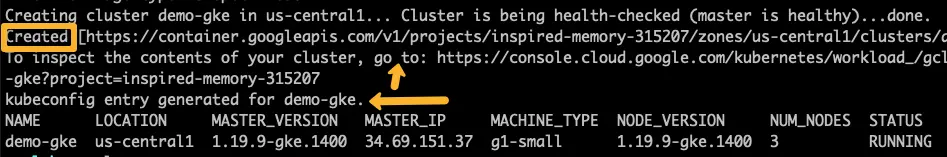

# Create the GKE VPC Network with Subnet & Secondary IP Ranges
  ## 1. Create a VPC
Create a vpc network named `gke-network`
``` Shell
gcloud compute networks create gke-network --subnet-mode=custom
```
  ## 2. Add a subnet with pod and service secondary range networks.
Create a subnet named gke-subnet-a with two secondary ranges named pod-network & service-network
```shell 
gcloud compute networks subnets create gke-subnet-a \
    --network gke-network \
    --region us-central1 \
    --range 10.0.1.0/24 \
    --secondary-range pod-network=172.16.0.0/18,service-network=172.16.64.0/20
```
Now we have the necessary network infrastructure to deploy a public GKE cluster. By default the subnet creates a route to the internet gateway and enabling internet access for the nodes. However, a custom firewall rules is needed to workloads through the nodes (NodePort) from outside the VPC network.

#### `Note:` _When running production workloads, careful consideration has been given to the network design by keeping the subnets fully private without internet gateways. Hence consider a private cluster over a plublic cluster_


# Setting Up Kubernetes Cluster On Google Cloud
  ## 1. Create GKE cluster
Use the gcloud CLI to launch a regional multi-zone cluster. Alternatively you can use Cloud SDK
``` shell
gcloud container clusters create demo-gke \
      --region us-central1 \
      --no-enable-ip-alias \
      --node-locations us-central1-a,us-central1-b,us-central1-c \
      --num-nodes 1 \
      --enable-autoscaling \
      --min-nodes 1 \
      --max-nodes 3 \
      --node-labels=env=dev \
      --machine-type g1-small \
      --enable-autorepair  \
      --node-labels=type=webapps \
      --enable-vertical-pod-autoscaling \
      --preemptible \
      --disk-type pd-standard \
      --disk-size 50 \
      --enable-ip-alias \
      --network gke-network \
      --subnetwork gke-subnet-a \
      --cluster-secondary-range-name pod-network \
      --services-secondary-range-name service-network \
      --tags=gke-webapps \
      --enable-master-authorized-networks \
      --master-authorized-networks=0.0.0.0/0
```
On a successful execution, you will see the cluster details in the output as shown


_This spin up the cluster in us-central1 the region g1-small(1.7GB) machine type with autoscaling enabled. Preemptible VMs with autoscaling to a maximum of three-node per to reduce the cost of the cluster. The cluster is deployed with the VPC network you created. Note: When deploying a cluster in production, more configurations need to be considered for the network and the cluster. It depends on the organizational policy and project requirements._

  ## 2. Verify the  GKE cluster information
``` Shell 
gcloud container clusters describe  demo-gke --region=us-central1
```

  ## 3. Connect to the cluster using  we need to download the cluster kubeconfig to our location workstation.
``` Shell
gcloud container clusters get-credentials demo-gke  --region=us-central1
```
This generates the kubeconfig and adds it to the ~/.kube/config file. You can also get the connect command from the GKE GUI(i.e. the Cloud Console).


# Deploy Nginx on GKE for Validation
Let’s deploy a sample Nginx application in a custom namespace to validate the cluster.

  ## 1. Create a namespace named demo
``` Shell
kubectl create namespace demo
```

  ## 2. Let’s deploy a sample Nginx app in the demo namespace. Also, create a Nodeport service for testing purposes.
``` Shell
cat <<EOF | kubectl apply -f -
---
apiVersion: apps/v1
kind: Deployment
metadata:
  name: nginx-deployment
  namespace: demo
spec:
  selector:
    matchLabels:
      app: nginx
  replicas: 2 
  template:
    metadata:
      labels:
        app: nginx
    spec:
      containers:
      - name: nginx
        image: nginx:latest
        ports:
        - containerPort: 80
---
apiVersion: v1
kind: Service
metadata:
  name: nginx-service
  namespace: demo
spec:
  selector:
    app: nginx
  type: NodePort
  ports:
    - port: 80
      targetPort: 80
      nodePort: 32000
EOF
```

  ## 3. Check the deployment status.
``` Shell
kubectl get deployments -n demo
```
  ## 4. Describe the service and check the nodePort details.
``` Shell
kubectl describe svc nginx-service -n demo
```
  ## 5. Create a firewall rule to access the app.
``` Shell
gcloud compute firewall-rules create gke-webapps \
    --network=gke-network \
    --allow=tcp:32000 \
    --description="Allow incoming traffic on TCP port 32000" \
    --direction=INGRESS \
    --source-ranges="0.0.0.0/0" \
    --target-tags="gke-webapps"
```
This will allow access to the application on node port 32000 from the the internet. This rule is applicable for all instances with gke-webapps tag in gke-network

  ## 6. Retrieve the External IP address of a Node
  Grab one IP and try accessing port 32000 and see if you can access the Nginx page.
``` Shell
gcloud compute instances list --filter="name~'gke-demo-*'"
```
  ## 7. Goto <http://Node External IP>:32000


  ## 8. Expose Nginx as a Loadbalancer Service
``` Shell
cat << EOF | kubectl apply -f -
apiVersion: v1
kind: Service
metadata:
  name: nginx-service
  namespace: demo
spec:
  selector:
    app: nginx
  type: LoadBalancer
  ports:
    - port: 80
      targetPort: 80
EOF
```
GKE will create a Loadbancer that points to the Nginx service endpoint.

# Clean up 
It is good to clean up the infrastructure once you are done to avoid unessary charges

  ## 1. Delete GKE Cluster
``` Shell
gcloud container clusters delete demo-gke --region us-central1  --quiet
```

  ## 2. Delete the firewall rule
``` Shell
gcloud compute firewall-rules delete gke-webapps --quiet
```

###............ You've completed the lab. Congratulations!!! ................... 
### ............................... END ........................................